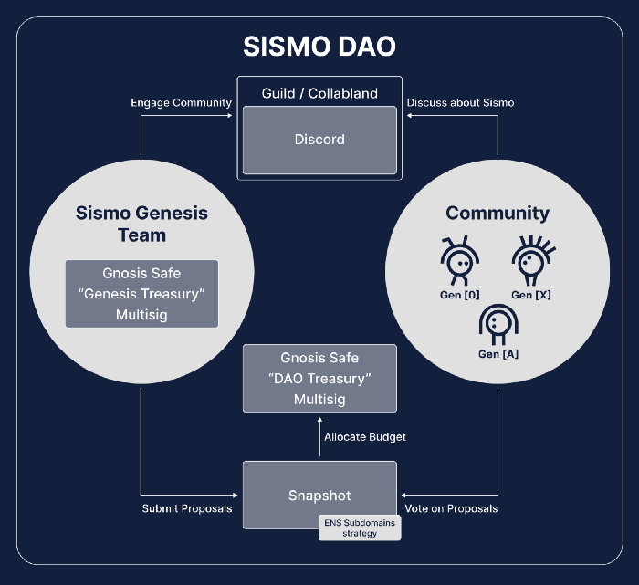

# What Is Sismo?

Sismo leverages zero-knowledge proofs (ZKPs) and privacy-preserving technologies to **enable** **users to aggregate and selectively disclose personal data** to applications.&#x20;

By using Sismo Connect, an easy-to-integrate SSO, applications **can now safely obtain user data that was previously inaccessible.**

[Sismo Connect](welcome-to-sismo/what-is-sismo-connect.md) aims to replace non-sovereign SSOs such Google Connect and improve limited SSOs such as Wallet Connect.&#x20;

<figure><figcaption></figcaption></figure>


Try out [demo apps](https://demo.apps.sismo.io/) on the Sismo App Store.


## Data Vault: Sovereign Identity Aggregator

Users aggregate their identity by adding Data Sources to their sovereign, local and private [Data Vault](how-sismo-works/technical-concepts/what-is-the-data-vault.md).

<figure><figcaption></figcaption></figure>

The Data Vault currently supports the following types of Data Sources: Ethereum wallets, GitHub, Twitter or Telegram accounts. Users can generate ZK Proofs from their Data Sources, enabling them to reveal data to applications in a sovereign way.

<figure><figcaption>
What a Data Vault looks like
</figcaption></figure>


You can create your own Data Vault and start aggregating your identity [here](https://vault-beta.sismo.io/).


## Sismo Connect: The Crypto-Native SSO

Sismo Connect is a crypto-native single sign-on method (SSO) for onchain and offchain apps. Sismo Connect makes it easy for developers to obtain users' personal data by requesting and verifying ZK proofs.

<figure><figcaption></figcaption></figure>

Integration is simple with just a few lines of code: import the front-end package or React button to make Sismo Connect requests, and verify proofs in your backend/ smart contracts using Sismo’s Solidity or TypeScript package.

Developers can request multiple personal data at once. There exist two types of data that can be requested:

* ZK Proof of Data Source ownership. (Ethereum wallets, GitHub, Twitter or Telegram accounts)
* ZK Proofs of Data Source inclusion in a specific Data Group. Data Groups can be created by anyone in the [Sismo Factory](https://factory.sismo.io).

Examples of Data Groups:

* Minters of  "[Stand with Crypto](https://nft.coinbase.com/collection/ethereum/0x9d90669665607f08005cae4a7098143f554c59ef)" NFT  ([Data Group](https://factory.sismo.io/groups-explorer?search=stand-with-crypto-nft-minters))
* Contributors to [Sismo Hub](https://github.com/sismo-core/sismo-hub) GitHub repo ([Data Group](https://factory.sismo.io/groups-explorer?search=sismo-hub-contributors-github))
* Gitcoin Passport Holders ([Data Group](https://factory.sismo.io/groups-explorer?search=gitcoin-passport-holders))
* [ENS DAO](https://docs.ens.domains/v/governance/) participants ([Data Group](https://factory.sismo.io/groups-explorer?search=ens-voters))
* Sismo Community Group ([Data Group](https://factory.sismo.io/groups-explorer?search=0xd630aa769278cacde879c5c0fe5d203c))

ZK-Proving inclusion in a Data Groups (e.g proving to be part of NFT owners without revealing the wallet) is actually revealing granular data about one's identity.


Discover applications leveraging the power of Sismo Connect on the [Sismo App Store](https://spaces.sismo.io/) and read the[ case studies](https://case-studies.sismo.io/) that we built around them.



Learn how to integrate Sismo Connect into applications [here](broken-reference).


## Prove & Verify

Sismo Connect technically let users participate in [proving schemes](how-sismo-works/core-components.md#what-are-proving-schemes) to make claims from their Data Sources.


A proving scheme is a cryptographic method that allows one party (the prover) to prove to another party (the verifier) that a certain statement is true without revealing how it is true—ensuring privacy.


<figure><figcaption></figcaption></figure>

The Data Vault includes the provers, enabling users to generate zero-knowledge proofs (ZKPs) from their Data Sources (proof of ownership/ proof of inclusion in a Data Group). The ZKP is then verified by the application (in a smart contract for onchain apps, in a backend of offchain apps, in a browser/client for p2p apps)

Sismo Connect is the developper experience (devX) layer on top of these proving schemes so developer do not have to think about them
