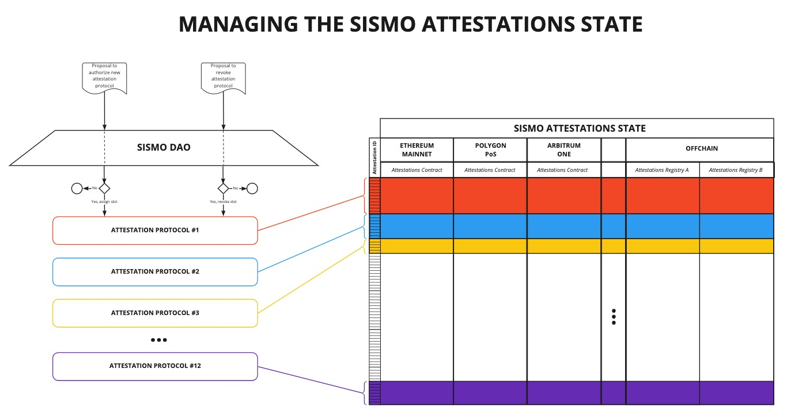

# Sismo 101

## Sismo's Core Mission

Sismo's core mission is to develop **an attestation management system focused on privacy, usability and decentralisation**. The Sismo Protocol will allow anyone to generate attestations from their personal data.&#x20;

Sismo attestations are built so they can be easily used by web2 and web3 applications as a reputation and authentication tool. Sismo aims, through its usable attestation, to contribute to building a decentralised version of SSOs, based on web3 login.

On Zikitor, Sismo Frontend, one can generate, from their web3 source accounts, a wide range of attestations such as "Owns of BAYC NFT", "Voted 2 times in ENS DAO" or "Sent more than 100 transactions on Ethereum".

Sismo Attestations are to be packaged as badges by default. Sismo badges are NFTs (ERC-1155, non-transferrable by default) wrapping the data of Sismo Attestations. This enables Sismo Attestations to be natively integrated in applications already using NFTs as a reputation system component, to control access to their services or to curate an identity.

MAIN SCHEME

\[Centré autour des Sismo attestations. Centré autour du user qu utilise zikitor pour créer son attestation. Il peut ensuite utiliser cette attestation pour SIWE/ faire qqchose onchain]

## Sismo Protocol

### Sismo protocol

Sismo Protocol is the set of rules linked to the creation, update and deletion of attestations in the Sismo Attestations State (SAS). The Sismo Attestations State is the database of all attestations collections created through Sismo Protocol. Sismo Protocol maintains a set of authorised attestation protocols that are allowed to write on the SAS.&#x20;

The SAS has 2^256 attestation collections slots, divided in shards.&#x20;

Authorised attestation protocols get each a dedicated shard in SAS and receive write access on the underlying attestation collections.

\[SCHEME 1: SAS, collection slots, shards, attestations collections]

### Attestation Protocols

An attestation protocol enables users to attest to a defined number of claims. \
Every claim supported by an authorised attestation protocol gets attributed an attestation collection in the SAS from its dedicated shard.\
\
All attestations to the same claim, collected by different users through the same attestation protocol get stored in the same collection of the SAS.

\[SCHEME 2: Attestation protocol: series of supported claims, a prover to generate attestation proof => create attestation through attester]

### Attestation creation: Example

Short example: ZK-SAP is a Zero Knowledge Attestation Protocol

* It allows anyone to prove that they own an address that is part of a list of addresses without revealing which address they own.
* ZK-SAP maintains the lists of addresses from which one can claim and generate its underlying attestation.
* Several claims can be attested using ZK-SAP
  * Claim #133: Proof that you own an address that owns a BAYC
  * Claim #22: Proof that you own an address that made a transaction before 2020

If ZK-SAP becomes the first authorized attestation protocol in Sismo, it will get attributed the shard #1

* BAYC Owners will be able within ZK-SAP, to prove the Claim #133
* The corresponding attestations get stored in the attestation collection slot #133, shard 1# of the SAS. Inside this collection lies all attestations created from the claim #133 of the ZK-SAP attestation protocol.

## Sismo Genesis Team

Sismo Genesis Team is **an engineering team developing software to support Sismo's mission**.&#x20;

It has 3 main roles:

* Develop Sismo Protocol core software,
* Build and maintain Zikitor Frontend to access Sismo Protocol,
* Create new ZK Attestation Protocols to be authorized by Sismo DAO.

The development and governance of the protocol will be progressively handed to the Sismo DAO.

The end goal of the Genesis Team is for the protocol to be governed autonomously and to foster the emergence of new frontends competing with Zikitor.

While Sismo Genesis Team will be mainly focused on proposing new Attestation Protocols focused on decentralized and trustless privacy, external teams will be able to create and add Attestations Protocols with different tradeoffs related to privacy, centralisation and transparency.

## Sismo DAO

Sismo DAO is a **protocol DAO** launched in October 2021 to progressively oversee and manage the development and maintenance of Sismo Protocol. It started as a social DAO, gathering curated generations of members sharing similar interests about privacy, reputation, identity and zero-knowledge technologies.&#x20;

Through progressive decentralization, it is now in charge of the allocation of a DAO treasury and will move step by step towards an administrative role over Sismo Protocol.


[sismo-dao.md](governance/sismo-dao.md)

