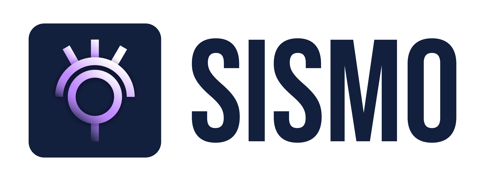

# What is Sismo?

Sismo is a modular **Attestation Protocol focused on decentralization, privacy and usability**.&#x20;


Using Sismo, one can generate, from their web3 source accounts, a wide range of attestations such as "Owns of BAYC NFT", "Voted 2 times in ENS DAO" or "Sent more than 100 transactions on Ethereum".


Sismo Attestations are especially useful for

* Web2/web3 gated services
* Reputations systems
* Decentralized Identities Curation

A strong focus of Sismo is on ZK Attestations - Attestations that do not reveal anything about how they are created. Their creation involves Zero Knowledge Proofs and ensures user privacy.

The protocol is modular and not all Attestation are created using ZKP. Several different types of attestations co-exist, with different tradeoffs on privacy - decentralization -scalability. &#x20;

Our goal is to feature a lot of interoperable attestations which are usable.

We build towards a decentralized version of a Single Sign-On (SSO) system, based on web3 login and user-generated attestations.


[sismo-attestation-protocol.md](archive/sismo-attestation-protocol.md)


## Sismo Genesis Team

Sismo Genesis Team is **the core engineering team developing software to support Sismo's mission**.&#x20;

It has 3 main roles:

* Kickstart the Sismo Protocol
* Develop and maintain new attesters
* Build products and tools to improve usability around attestations

They are the initial core maintainers of Sismo Attestation Protocol, while the development and governance is to be progressively handed to Sismo DAO.


Join Sismo Genesis Team


## Sismo DAO

Sismo DAO is a **protocol DAO** launched in October 2021 to progressively oversee and manage the development and maintenance of Sismo Protocol. It started as a social DAO, gathering curated generations of members sharing similar interests about privacy, reputation, identity and zero-knowledge proofs.&#x20;

It is currently in charge of the allocation of Sismo DAO treasury and will move step by step towards an administrative role over Sismo Attestation Protocol.


[Broken link](broken-reference)

