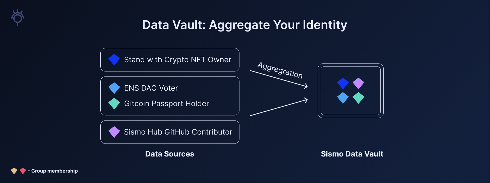

# Sismo: A Communication Protocol

Currently, the digital landscape is defined by the need for **aggregation,** with **privacy** as an essential precondition:

* Web2 platforms, such as Twitter, confine our data within their respective silos, preventing us from leveraging our social capital across multiple platforms.
* On web3, privacy concerns create barriers for users and applications. Users hesitate to link their private and public accounts due to the fear of exposing sensitive information, while developers, fully aware of the privacy implications, avoid the concept of data aggregation entirely.
* Until now, no solution existed for the private aggregation of web2 and web3 data in a single place, such as linking a user’s bank account, social media profiles, and onchain history without exposing sensitive information.

Sismo, a communication protocol, leverages privacy-preserving technology to bridge the gap between personal data and applications. It enables users to get the most out of their data while providing app developers with the means to request and utilize it responsibly.


With Sismo, you can:

* Aggregate your web2 and web3 data in a private Data Vault that you truly own.
* Selectively disclose your data to apps via Sismo Connect—the crypto-native SSO.


<figure><figcaption></figcaption></figure>

## Data Vault: Aggregate Your Identity

Fundamentally, Sismo revolves around communication between personal data and applications. To utilize Sismo’s communication protocol, users aggregate their identity in their own Data Vault. By doing so, they unlock the power to leverage their data across multiple platforms.


The Data Vault is encrypted storage for a user's personal data from various web2 and web3 accounts, credentials, and attestations.


These contents of a Data Vault are collectively referred to as Data Sources. The granular pieces of data within Data Sources are characterized as Data Gems. A Data Gem is a valuable element of a user’s digital identity. Examples of Data Gems include:

* Entrants to the Proof of Humanity registry
* Contributors to Sismo
* French citizens

The Data Vault acts as a private, local and secure place where users can have a complete overview of their digital identity, providing ownership and control over personal data.

<figure><figcaption></figcaption></figure>


You can create your own Data Vault and start aggregating your identity [here](https://vault-beta.sismo.io/).


## Prove & Verify: Selective Disclosure

To prove ownership of Data Gems (granular data stored in the Vault), users leverage Sismo’s communication protocol to participate in [proving schemes](knowledge-base/resources/technical-concepts/proving-schemes/). Proving ownership of Data Gems proves membership in [Data Groups](knowledge-base/resources/technical-concepts/data-groups.md)—the Sismo protocol’s open-source data infrastructure.


A proving scheme is a cryptographic method that allows one party (the prover) to prove to another party (the verifier) that a certain statement is true, without revealing how it is true—ensuring privacy.


The Data Vault acts as a prover, enabling users to generate zero-knowledge proofs (ZKPs) that attest ownership of Data Gems. A user generates a proof to make a claim about Data Gems that they own—which can be subsequently verified.

Verifiers integrated into applications accept proofs from users and ensure their validity—whether in onchain smart contracts or offchain backends. In this sense, users can selectively disclose Data Gems to applications without revealing the associated Data Source.

<figure><figcaption></figcaption></figure>

## Sismo Connect: The Crypto-Native SSO

Sismo Connect is a crypto-native single sign-on method (SSO) for the next generation of applications, whether onchain or offchain. Designed with developers in mind, Sismo Connect establishes communication between the prover in a user’s Data Vault and verifiers integrated into applications. As a result, Sismo Connect serves as the developer-centered method of leveraging Sismo’s communication protocol.


Discover applications leveraging the power of Sismo Connect on [Sismo Spaces](https://spaces.sismo.io/).


Integration is simple with just a few lines of code: import the front-end package or React button for data requests, and verify proofs using Sismo’s Solidity or TypeScript package. Once integrated, applications can **request** private and granular data, while users can **authenticate** and **selectively disclose** their personal data.


Learn how to integrate Sismo Connect into applications [here](build-with-sismo-connect/overview.md).


Applications may require just a fraction of a user’s data or data from multiple accounts for access control or reputation importation. In the example below, zkDrop airdrops an NFT to users that own two Data Gems—a Gitcoin Passport and a Nouns NFT. With the power of Sismo Connect, users can hold these Data Gems in separate wallets without creating immutable links between them.

<figure><figcaption></figcaption></figure>
