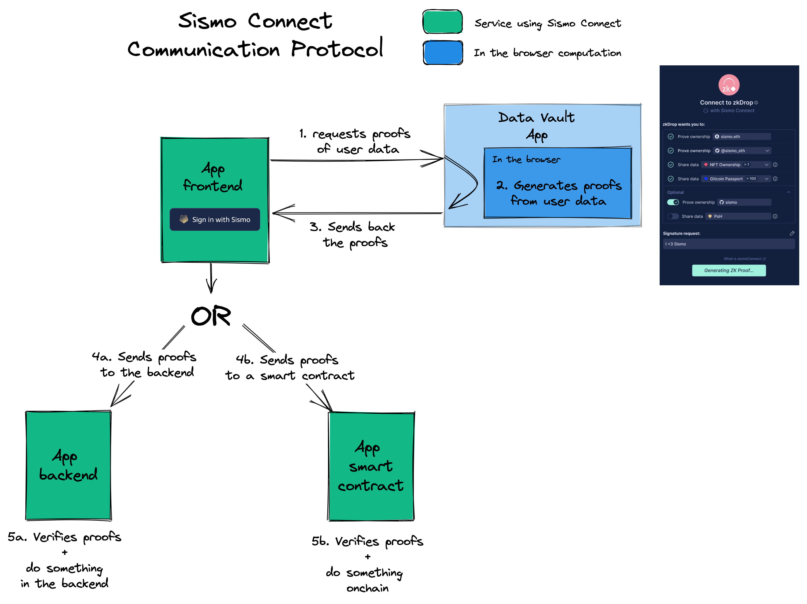

# Technical Documentation

[Sismo Connect](../../discover-sismo-connect/empower-your-app.md) is a crypto-native single sign-on method (SSO) for applications—whether on web2 or web3. Integration is simple with just a few lines of code: import the front-end package or React button for data requests, and verify proofs using Sismo’s Solidity or TypeScript package. Once integrated, applications can **request** private and granular data, while users can **authenticate** and **selectively disclose** their personal data with the power of zero-knowledge proofs (ZKPs).


In order to use Sismo Connect, you will need to have an `appId` registered in the [Sismo Factory](https://factory.sismo.io/). You can register your appId [here](https://factory.sismo.io/apps-explorer).


In the schema below, you can observe how Sismo Connect functions with both **onchain** and **offchain** applications:

<figure><figcaption></figcaption></figure>

## **Packages**

* [`@sismo-core/sismo-connect-client`](https://github.com/sismo-core/sismo-connect-packages/tree/main/packages/sismo-connect-client): the frontend [package](client.md) to easily request ZKPs from users in a privacy-preserving manner.
* [`@sismo-core/sismo-connect-react`](https://github.com/sismo-core/sismo-connect-packages/tree/main/packages/sismo-connect-react): the React frontend [package](react.md) to easily integrate the sismoConnectButton and sismo-connect-client in your React app.
* [`@sismo-core/sismo-connect-server`](https://github.com/sismo-core/sismo-connect-packages/tree/main/packages/sismo-connect-server): the backend [package](server.md) to easily verify ZKPs offchain.
* [`@sismo-core/sismo-connect-solidity`](https://github.com/sismo-core/sismo-connect-packages/tree/main/packages/sismo-connect-solidity) : the [Solidity Library](solidity.md) to easily verify ZKPs onchain.


Learn how to integrate Sismo Connect via these [tutorials](../tutorials/).&#x20;


## Glossary

### appId

The unique identifier of your Sismo Connect application registered on the [Sismo Factory](../../sismo-factory/what-is-the-sismo-factory.md).

### Claim

A claim is requested through a claimRequest to the Data Vault in order to generate a group membership proof. It contains the group Id, the groupTimestamp, and the value you claim to have in the associated [Data Group](../../knowledge-base/resources/technical-concepts/data-groups.md).

> Example: Prove that you are part of the Sismo Contributor Group with a minimum value of 2.

### Auth

An auth is requested through an authRequest to the [Data Vault](../../what-is-sismo/personal-data-sismos-data-vault-gems-and-groups.md) in order to generate a proof of account ownership. It can be ownership of an Ethereum address or a Twitter, or GitHub account.

> Example: Prove that you own a Twitter account.

### Signature

The Signature will request to generate a proof that can't be verified without a specific signature associated with it.

> Example: You are a DAO voting platform, and you want to get the vote of a user. To do so, the user will create a signature containing a message (his vote) that will be used to generate the proof. Then by verifying the proof, you are also verifying the authenticity of the signature and thus the vote.

### namespace

By default set to “main”. You can optionally define a `namespace` on top of the `appId` to use the Sismo Connect flow in different parts of your application. This is useful if you do not want users to generate the same proof for different services in your application. For example, if your application is a DAO voting website, you may define a different `namespace` for every vote and use the `proofId` as a nullifier. Subsequently, users will be able to vote only once as each proof request with a distinct `namespace` generates a distinct `proofId` for the same user. Learn more about Proof Identifiers [**here**](../../knowledge-base/resources/technical-concepts/vault-and-proof-identifiers.md).

### version

The version of the Data Vault app. The only version that currently works is `sismo-connect-v1`.

### groupId

The unique identifier of the group of accounts users prove membership in to generate a valid ZKP. [Data Groups](../../knowledge-base/resources/technical-concepts/data-groups.md) are maintained by Sismo and can be created by anyone using the [Sismo Factory](https://factory.sismo.io/). They are composed of a name, a description, specifications, a timestamp, and data. Moreover, they are split into Group Snapshots which are timestamped.

### groupTimeStamp

Groups are composed of snapshots generated either once, daily, or weekly. Each Group Snapshot generated has an associated timestamp. By default, the selected group is the latest Group Snapshot generated. However, you are free to select a Group Snapshot with a timestamp other than the latest one.

### Vault Id and Proof Identifiers

The `userId` can contain different types of identifiers based on the `authType` requested. For instance, it can hold a Github Id for `AuthType.Github`, a Twitter id for `AuthType.Twitter`, an EVM address for `AuthType.EVM_ACCOUNT`, or a `vaultId` for `AuthType.VAULT`.

It's noteworthy that the `vaultId` is deterministically generated from the user's vault secret and the `appId` using a Poseidon hash. Consequently, if a user revisits your app, the `vaultId` remains consistent, but it will differ for other apps. This feature is beneficial if you wish to link a `vaultId` to a user in your database while preserving the user's privacy across various apps. You can delve deeper into the `vaultId` concept [here](../../knowledge-base/resources/technical-concepts/vault-and-proof-identifiers.md).

The `SismoConnectVerifiedResult`'s `verifiedClaim` also includes a `proofId`. This `proofId` is a unique identifier that represents a proof from Sismo. Similar to `vaultId`, the `proofId` is deterministically generated based on the `appId`, the `namespace`, the `groupId`, and the `groupTimestamp`. It enables you to verify if a user has previously submitted proof to your app for a specific namespace and group.

The `proofId` can be particularly handy if you want to organize private polls while ensuring each participant only votes once. For every poll, you can assign a distinct `namespace` such as `namespace: "my-poll-x"`, so a unique `proofId` is calculated for each instance. By storing the `proofId` and `vaultId` in your apps, you can guarantee that a user associated with a specific `vaultId` votes only once in each private poll.
