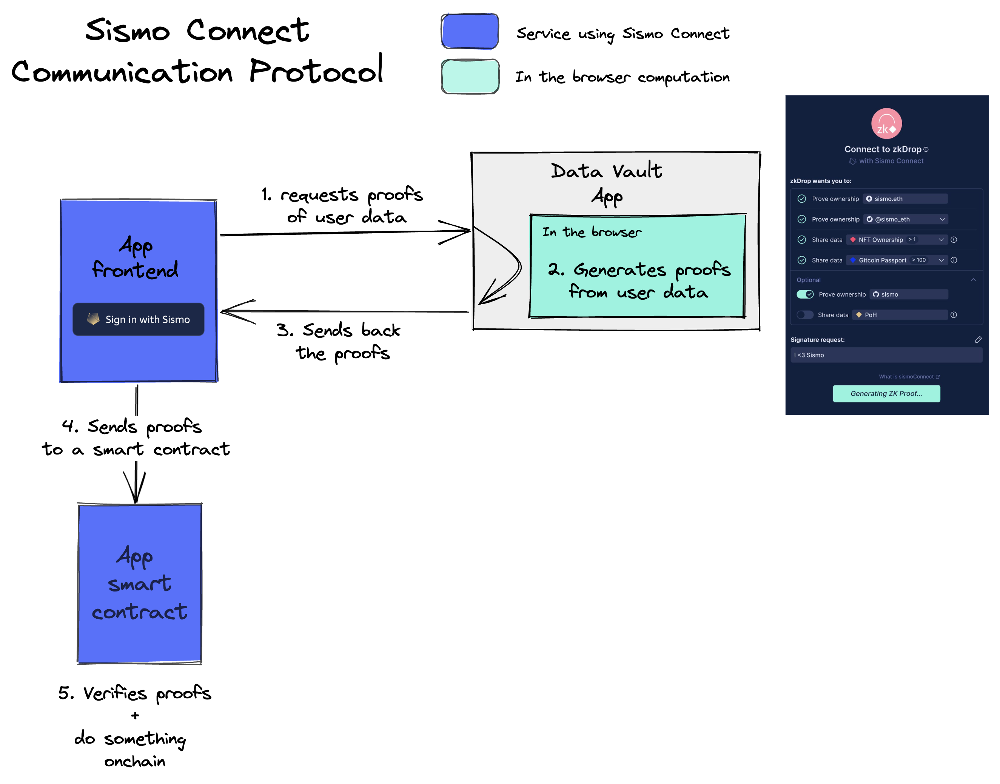

# Build a Gated Airdrop

## Overview

This tutorial is designed as an **introduction** to **Sismo Connect Solidity** Library. It aims at showcasing the integration steps of Sismo Connect to easily gate an airdrop to Gitcoin Passport holders while explaining some useful concepts of the Sismo Connect communication protocol.&#x20;

You will learn how to request proofs about your users data, verify them in your contracts and how privacy and data aggregation can be leveraged for your app thanks to Sismo Connect.

If you wish to understand what is Sismo Connect from a high level view, we advise you to read about it in the [Discover Sismo Connect section](../../../discover-sismo-connect/empower-your-app.md).

## Prerequisites

This tutorial requires:

* [Node.js](https://nodejs.org/en/download/) >= 18.15.0 (Latest LTS version)
* [Yarn](https://classic.yarnpkg.com/en/docs/install)
* [Foundry](https://book.getfoundry.sh/) (see how to install it [here](https://book.getfoundry.sh/getting-started/installation))&#x20;
* Metamask installed in your browser


We use Foundry for our smart contract dependencies but we also have a [**Hardhat library**](https://www.npmjs.com/package/@sismo-core/sismo-connect-solidity). A tutorial with Hardhat integration will be made in the coming weeks. Don't hesitate to ask questions on our [Builder Telegram](https://t.me/+Z-SwcvXZFRVhZTQ0) group if you have any.



Also, since you will use your Developer Vault in this tutorial, we encourage you to set it up if it's not done yet by connecting a wallet at [https://dev.vault-beta.sismo.io/](https://dev.vault-beta.sismo.io/). Feel free to add some addresses that will be useful for this tutorial!


## Installation

This tutorial is based on the following [**tutorial repository**](https://github.com/sismo-core/sismo-connect-onchain-tutorial). You can clone it with the following command:

<pre class="language-bash"><code class="lang-bash"><strong>git clone https://github.com/sismo-core/sismo-connect-onchain-tutorial
</strong>cd sismo-connect-onchain-tutorial
yarn
</code></pre>

#### Install contract dependencies

```bash
# updates foundry
foundryup
# install smart contract dependencies
forge install
```

#### Launch a local fork chain

```bash
# in another terminal
# starts a local fork of Mumbai
yarn anvil
```

#### Launch the local application

You can now launch your local dapp with the commands:

```bash
# in another terminal
cd front
# install frontend dependencies
yarn
# launch local application
yarn dev
```

This command starts the NextJs application that calls the contract in `src/Airdrop.sol` that has been deployed on your local fork of Mumbai. You should now have the simple tutorial application running on [http://localhost:3000](http://localhost:3000).

<figure><figcaption><p>Your local frontend</p></figcaption></figure>

You can now play with the local app that already integrates Sismo Connect by connecting your wallet and signing in with Sismo.

<figure><figcaption><p>Connect your wallet where you wish to receive the airdrop</p></figcaption></figure>

Once you are redirected from your Sismo Vault, you can click on the "Claim NFT" button, you are then shown that you have successfully claim the airdrop.&#x20;

<figure><figcaption><p>Claim successfully your airdrop</p></figcaption></figure>

### Important note


The interaction with the fork network can become quite unstable if you stop the `yarn anvil` command at some point or if you already use the sample app before.

You can end up with a infinite pending transaction.

If so:

* keep the local anvil node running,&#x20;
* make sure to delete your activity tab for the fork network in Metamask by going to "Settings > Advanced > Clear activity tab data" when connected to the fork network.&#x20;
* relaunch the anvil node and the application

See [FAQ](../../faq.md) for more informations.



This tutorial does not need any `anvil` restart or frontend restart, everything auto reloads for you. You should only save the files you make changes to and play with your frontend.


Congrats on getting your airdrop! Now, let's see how this simple Sismo Connect integration works behind the scene and let's improve it along the way. Let's start with the authentication you just experimented.

## Authenticate your users

Among other things, Sismo Connect allows a simple user authentication for your application. It works by requesting an authentication (shorten to **auth**) of type **VAULT** to your users. What does it mean?&#x20;

Each Sismo user has a Data Vault, where all his data is stored securely. As a developer, you can request to your users some proofs about the data in their Vault. In the case of an auth of type VAULT, you request a proof of ownership of a Sismo Vault from your users. When they are done generating the proof in their vault, they are redirected to your application with a Sismo Connect Response that holds the proof but also a `vaultId`.&#x20;

The **`vaultId`** is the **unique identifier of a user vault for a specific application**, it is computed as the **hash** of the **userVaultSecret** and the **appId**. If you want to learn more about the `vaultId`, you can read more about it in [Vault & Proof Identifiers](../../../knowledge-base/resources/technical-concepts/vault-and-proof-identifiers.md).

You can also see a general scheme below showing you the high-level workflow with several proof requests to a user.

<figure><figcaption><p>Sismo Connect high-level workflow</p></figcaption></figure>

### Create a Sismo Connect client configuration

To see how we created the auth request, you can go to the `front/src/pages/claim-airdrop.tsx` file. The first thing we do is defining a **Sismo Connect client configuration**, this config will let the Sismo Vault app knows about the `appId` from which the requests are made. In this tutorial, we use `0xf4977993e52606cfd67b7a1cde717069` for the `appId`.


In order to use Sismo Connect in your application, you will first need to create an application  in the [Sismo Factory](https://factory.sismo.io/apps-explorer) and get its `appId`. You can see a quick tutorial on how to do it [here](../../../sismo-factory/create-a-sismo-connect-app.md).


```typescript
// you are in: front/src/claim-airdrop.tsx

import {
  SismoConnectButton, // the react button displayed above
  SismoConnectClientConfig, // the client config with your appId
  AuthType, // the authType enum, we will choose 'VAULT' in this tutorial
} from "@sismo-core/sismo-connect-react";

export const sismoConnectConfig: SismoConnectClientConfig = {
  // you can create a new Sismo Connect app at https://factory.sismo.io
  appId: "0xf4977993e52606cfd67b7a1cde717069",
  devMode: {
    // enable or disable dev mode here to use the development vault when developing
    // you need to remove the devMode when deploying in production
    enabled: true,
  },
};
```

You can spot in the snippets all the imports needed for the tutorial to work smoothly and the client configuration that you create with the `appId` from the Factory.


The `devMode` in the configuration should be omitted if you are in production mode, it specifies which vault you want to redirect yours users to, the developer vaults (if `true`) or the production vaults (if `false`).


### Create a Sismo Connect button&#x20;

The [**@sismo-core/sismo-connect-react**](../../technical-documentation/react.md) library simplifies the Sismo Connect integration since it offers a React button to easily request proofs of your users data.&#x20;

<figure><figcaption><p>Sismo Connect React button</p></figcaption></figure>

The configuration is now helpful to setup properly our Sismo Connect button. You will see below the full button props that are explained in detail after the code snippet.

```typescript

// you are still in: front/src/claim-airdrop.tsx
 
<SismoConnectButton
 // the client config created
 config={sismoConnectConfig}
 // the auth request we want to make
 // here we want the proof of a Sismo Vault ownership from our users
 auths={[{ authType: AuthType.VAULT }]}
 // we ask the user to sign a message
 // it will be used onchain to prevent front running
 signature={{ message: signMessage(account) }}
 // onResponseBytes calls a 'setResponse' function 
 // with the responseBytes returned by the Sismo Vault
 onResponseBytes={(responseBytes: string) => setResponse(responseBytes)}
 // Some text to display on the button
 text={"Claim with Sismo"}
/>
```

What are the different react button props?

* the **`config`** prop will let the Sismo Vault app knows about the `appId`  from which the requests are made.&#x20;
* the **`auths`** prop defines the different auth requests we want our users to prove ownership of (in this case, that they own a Vault at Sismo).&#x20;
* the **`signature`** prop dictates which message should be signed by the user when generating the proof in there Sismo Vault (here we want them to sign the address on which they want to receive the airdrop).&#x20;


By making the user sign this message and by checking the signature in the contract, we ensure that the proof cannot be reused from someone else. It is basically a protection from being front run.


<details>

<summary>Why do we need a signature when verifying proofs on-chain?</summary>

The signed message is not mandatory when you interact with your contracts but it is very often needed. As far as your users are generating valid proofs, it could be quite easy for a third party to front run them by just taking their proof and make their own call to your smart contracts with it.

To overcome this issue, we offer a way to embed a specific message in a proof. This way it can be thought as a signature since this proof could not be valid without checking successfully that the signed message is correct on-chain.&#x20;

Here for example, we request the user to embed the address where they want to receive the airdrop in the proof. If a third party takes the proof, the call will be reverted with a signature mismatch message, effectively proteting your users from being front run.

</details>

* the **`onResponseBytes`** prop specifies which logic to trigger when we receive the Sismo Connect response (holding the proofs) from the Sismo Vault app (here we just want to save the response in a React state to use it after when calling the contract).
* the **`text`** prop defines which text to display on the button (default being "Sign in with Sismo")

You should have a pretty good understanding of the button at this point but if you want to see the complete documentation around the [**@sismo-core/sismo-connect-react**](../../technical-documentation/react.md) library, feel free to check the [**technical documentation**](../../technical-documentation/react.md).&#x20;

Now let's see how the contracts are working!

## Verify proofs onchain

Now that you know how to request proofs from your users data, you still need to know how to verify them. You can go to `src/Airdrop.sol` to see the contract code.

```solidity
// you are in: src/Airdrop.sol

// SPDX-License-Identifier: MIT
pragma solidity ^0.8.17;

import {ERC721} from "@openzeppelin/contracts/token/ERC721/ERC721.sol";
// Sismo Connect import
import "sismo-connect-solidity/SismoLib.sol"; 
```

You will start by inheriting from Sismo Connect by importing the library, add the inheritance and specify your `appId` in the contract to be able to pass it in the constructor.

```solidity
// you are in: src/Airdrop.sol

// SPDX-License-Identifier: MIT
pragma solidity ^0.8.17;

import {ERC721} from "@openzeppelin/contracts/token/ERC721/ERC721.sol";
// Sismo Connect import
import "sismo-connect-solidity/SismoLib.sol"; 

contract Airdrop is ERC721, SismoConnect { // <--- add a Sismo Connect inheritance
    // add your appId as a constant
    bytes16 public constant APP_ID = 0xf4977993e52606cfd67b7a1cde717069;
    
    constructor(
        string memory name,
        string memory symbol
    ) ERC721(name, symbol) 
    // add a Sismo Connect constructor
      SismoConnect(APP_ID)
    {}
...
}
```

You can then take a look at the `claimWithSismo` function that we call from the frontend. It takes a Sismo Connect Response as `bytes`  as argument, verifies the proof it holds with respect to the auth request and the signature expected. If the proof is valid, it gets the `vaultId` from the Sismo Connect Verified Result and use it as a tokenId. The `vaultId` being the anonymous identifier of a user's vault for a specific app, defined as hash(`userVaultSecret`, `appId`).

What is interesting here is that the `vaultId` is a protection from double spendings. Indeed, if a user generates a second proof from the same vault he would not be able to claim a second NFT since each proof generated from a Vault has the same `vaultId` associated to it.&#x20;

```solidity
// you are in src/Airdrop.sol

contract Airdrop is ERC721, SismoConnect {

    ....
    
    function claimWithSismo(bytes memory response) public {
        SismoConnectVerifiedResult memory result = verify({
            responseBytes: response,
            // we want the user to prove that he owns a Sismo Vault
            // we are recreating the auth request made in the frontend to be sure that 
            // the proofs provided in the response are valid with respect to this auth request
            auth: buildAuth({authType: AuthType.VAULT}),
            // we also want to check if the signed message provided in the response is the signature of the user's address
            signature:  buildSignature({message: abi.encode(msg.sender)})
        });
    
        // if the proofs and signed message are valid, we take the userId from the verified result
        // in this case the userId is the vaultId (since we used AuthType.VAULT in the auth request), 
        // it is the anonymous identifier of a user's vault for a specific app 
        // --> vaultId = hash(userVaultSecret, appId)
        // In this contract, we use this vaultId as the tokenId of the NFT we mint to the user
        // This way, all proofs that are generated from the same vault will try to mint the same tokenId
        // So if a user tries to claim twice with a proof from the same vault, the vaultId will be the same and the contract will revert
        uint256 tokenId = result.getUserId(AuthType.VAULT);
        _mint(msg.sender, tokenId);
    }
    ....
}
```

The integration is basically done! Notice how we can remove logic around the tokenId with this simple trick around the `vaultId`, interesting feature isn't it?&#x20;

Ok, so if we recap an onchain Sismo Connect integration, it all comes to:

* the creation of an app in the Sismo Factory, to get an `appId`
* a client configuration in the frontend with this `appId` (thanks to the [**@sismo-core/sismo-connect-react**](../../technical-documentation/react.md) library for example)
* the configuration of the React button to choose which proofs to requests from your users
* the creation of a smart contract to verify the user proofs onchain

Well, now that you have all this steps in mind, let's improve this airdrop contract by only allowing **Gitcoin Passport holders** to claim the NFT.&#x20;

## Request proof of group membership

To gate our airdrop contract to Gitcoin Passport holders, we simply need to ask for a proof of Gitcoin Passport group membership from our users. This can be done by taking the `groupId` of the Gitcoin Passport Holders group that can be found on the Sismo Factory at this link: [https://factory.sismo.io/groups-explorer?search=gitcoin-passport-holders](https://factory.sismo.io/groups-explorer?search=gitcoin-passport-holders) and create a **claim request** from it.

The groupId of the Gitcoin Passport Holders group is `0x1cde61966decb8600dfd0749bd371f12`. Let's add our claim request in the React button:

```typescript
// you are in: front/src/claim-airdrop.tsx

export default function ClaimAirdrop() {
// add the groupId
const GITCOIN_PASSPORT_HOLDERS_GROUP_ID = "0x1cde61966decb8600dfd0749bd371f12";

...
 
 return (
  ...
  
 <SismoConnectButton
  config={sismoConnectConfig}
  auths={[{ authType: AuthType.VAULT }]}
  // request a proof of group membership from your users
  // They should hold a Gitcoin Passport
  claims={[{ groupId: GITCOIN_PASSPORT_HOLDERS_GROUP_ID }]} // <-- pass the groupId
  signature={{ message: signMessage(account) }}
  onResponseBytes={(responseBytes: string) => verify(responseBytes)}
  text={"Claim with Sismo"}
 />
 
  ...
)
```

Once you have created this claim request in the frontend, you also need to add it in the smart contract. Always remember that the proofs sent to the smart contract need to be checked with respect to some requests.&#x20;

```solidity
// you are in src/Airdrop.sol

contract Airdrop is ERC721, SismoConnect {
    ...
    // add your groupId as a constant
    bytes16 public constant GITCOIN_PASSPORT_HOLDERS_GROUP_ID = 0x1cde61966decb8600dfd0749bd371f12;
        
    ...
        
    function claimWithSismo(bytes memory response) public {
        SismoConnectVerifiedResult memory result = verify({
            responseBytes: response,
            auth: buildAuth({authType: AuthType.VAULT}),
            // add the claim request to check that the proof provided is valid
            // with respect to the Gitcoin Passport requirement
            claim: buildClaim({groupId: GITCOIN_PASSPORT_HOLDERS_GROUP_ID}), // <-- pass the groupId
            signature:  buildSignature({message: abi.encode(msg.sender)})
        });
    
        uint256 tokenId = SismoConnectHelper.getUserId(result, AuthType.VAULT);
        _mint(msg.sender, tokenId);
    }
    ...
}
```

These simple code additions now allow our smart contract to only airdrop a NFT to holders of a Gitcoin Passport. While this is exciting, how can we quickly test it in our local frontend if we are not a Gitcoin Passport holder?&#x20;

The simplest solution is to add a developer group in the Sismo Connect client config. This developer group should only be present in your frontend file when developing in local since it overrides the real Gitcoin Passport holders group when redirected to your Vault, allowing specific users to prove something false (here that they own a Gitcoin Passport).&#x20;


Don't forget to remove the `devMode` in production.


```typescript
// you are in: front/src/claim-airdrop.tsx

export const sismoConnectConfig: SismoConnectClientConfig = {
  appId: "0xf4977993e52606cfd67b7a1cde717069",
  devMode: {
    enabled: true,
    devGroups: [devGroups[1]], // <-- add this line
  },
};
```

When you have added this devGroup, you should also add your address to it so that you will be able to prove that you own a Gitcoin Passport.&#x20;


The address you choose should be an address imported in your Vault. If it's not the case, don't forget to import it when you will be redirected to generate the proof.


To add your address, go to the `front/config.ts` file. You will see where to input your address at the top of the file.

```typescript
// you are in : front/src/config.ts

///////////////////

// Replace with your address to become eligible for the airdrops
export const yourAddress = "0x..."; // <--- Replace with your address

///////////////////

```

When all of this is done, you can try again to go on your local application on [http://localhost:3000](http://localhost:3000) to see the new proofs requested.&#x20;


**You don't need to do anything with anvil or your frontend application in your terminals, all is reloaded automatically for you. Just play with your front!**&#x20;


As you can see below, you are now asked to share your `vaultId` like before and you also should prove that you own a Gitcoin Passport. You also keep signing the address on which you want to receive the airdrop.

<figure><figcaption><p>Sismo Vault UI when redirected</p></figcaption></figure>


The interaction with the fork network can become quite unstable if you stop the `yarn anvil` command at some point or if you already use the sample app before.

You can end up with a infinite pending transaction.

If so:

* keep the local anvil node running,&#x20;
* make sure to delete your activity tab for the fork network in Metamask by going to "Settings > Advanced > Clear activity tab data" when connected to the fork network.&#x20;
* relaunch the anvil node and the application

See [FAQ](../../faq.md) for more informations.


Congrats again! You have successfully gated your application for holders of Gitcoin Passport. You also prevent double spendings thanks to the vaultId used as the tokenId of the minted NFT.&#x20;

Let's see how to ultimately combine data aggregation with privacy now by gating the airdrop to Gitcoin Passport holders holding at least one Nouns Dao NFT.

## Combine data aggregation and privacy

To do this, we will simply do the same logic as before by creating an additional claim request for the Nouns DAO NFT holders group with the id `0x311ece950f9ec55757eb95f3182ae5e2` (you can see the group description in the Sismo Factory [here](https://factory.sismo.io/groups-explorer?search=nouns-dao-nft-holders)).

You can add the claim request in the frontend:

```typescript
// you are in: front/src/claim-airdrop.tsx

export default function ClaimAirdrop() {
// add the groupId
const NOUNS_DAO_HOLDERS = "0x311ece950f9ec55757eb95f3182ae5e2";

...
 
 return (
  ...
  
 <SismoConnectButton
  config={sismoConnectConfig}
  auths={[{ authType: AuthType.VAULT }]}
  // request an additional proof of group membership from your users
  // They should hold a Nouns DAO NFT
  // but also the Gitcoin Passport as before
  claims={[
   { groupId: GITCOIN_PASSPORT_HOLDERS },
   { groupId: NOUNS_DAO_HOLDERS } // <-- pass the groupId
  ]}
  signature={{ message: signMessage(account) }}
  onResponseBytes={(responseBytes: string) => verify(responseBytes)}
  text={"Claim with Sismo"}
 />
 
  ...
)
```

Add the claim request in the smart contract:&#x20;

<pre class="language-solidity"><code class="lang-solidity">// you are in src/Airdrop.sol

contract Airdrop is ERC721, SismoConnect {
    ...
    // add your groupId as a constant
    bytes16 public constant NOUNS_DAO_HOLDERS = 0x311ece950f9ec55757eb95f3182ae5e2;
        
    ...
        
    function claimWithSismo(bytes memory response) public {
<strong>        AuthRequest[] memory auths = new AuthRequest[](1);
</strong>        auths[0] = buildAuth({authType: AuthType.VAULT});
        
        // add the claim request to check that the proof provided is valid
        // with respect to the Gitcoin Passport requirement
        // but also the Nouns DAO requirement
        ClaimRequest[] memory claims = new ClaimRequest[](2);
        claims[0] = buildClaim({groupId: GITCOIN_PASSPORT_HOLDERS});
        claims[1] = buildClaim({groupId: NOUNS_DAO_HOLDERS}); // &#x3C;-- pass the groupId
        
        // we create a request object that will be passed in the verify function
        // with the response
        SismoConnectRequest memory request = _requestBuilder.build({
          claims: claims,
          auths: auths,
          signature: buildSignature({message: abi.encode(msg.sender)}),
          appId: appId
        });
        
        SismoConnectVerifiedResult memory result = verify({
            responseBytes: response,
            request: request // &#x3C;-- the request is passed here
        });
    
        uint256 tokenId = SismoConnectHelper.getUserId(result, AuthType.VAULT);
        _mint(msg.sender, tokenId);
    }
    ...
}
</code></pre>

Once you have done that, you can update the devGroups in the client config. Here we take all the devGroups (that contains fake groups for Gitcoin Passport and Nouns Dao holders groups). Remember to not let such configuration in a production environment!

```typescript
// you are in: front/src/claim-airdrop.tsx

export const sismoConnectConfig: SismoConnectClientConfig = {
  appId: "0xf4977993e52606cfd67b7a1cde717069",
  devMode: {
    enabled: true,
    devGroups, // <-- add this line instead of `devGroups: [devGroups[1]],`
  },
};
```

You can try again to claim the airdrop from your application, you will see the auth request with the two claim requests and the sign message.&#x20;

<figure><figcaption><p>Sismo Vault UI when redirected</p></figcaption></figure>

And it is our final congrats! 🎉

If we recap, you basically managed to go from a simple request of Vault ownership to a complex multi request of Vault ownership + group memberships. All these requests respect the user privacy since no ethereum address is ever shared during the flow and all of this is made possible thanks to the data aggregation that offers the Sismo Vault.&#x20;

## Next steps

If you have any questions about integrating sismoConnect, don’t hesitate to reach out. The team will be happy to answer any questions you may have. Any feedback is also welcomed!

Get involved in the Sismo community! 🎭

* Look out for [**hackathons**](https://www.notion.so/sismo/Sismo-x-ETHPorto-2023-cbda827ea5f2469aa5fdbb4955fc18d6?pvs=4) that we are participating in
* Join our [**Discord**](https://discord.gg/sismo) or our [**Dev** **Telegram**](https://t.me/+Z-SwcvXZFRVhZTQ0)
* See the [**Sismo-hub contributing page**](https://github.com/sismo-core/sismo-hub/issues)
