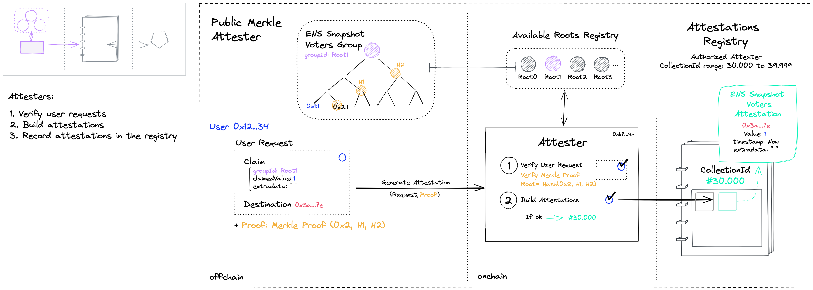

# General FAQ

### What is a Badge?

A Badge is a non-transferable token (ERC1155) that represents an attestation. Badges prove facts about a user's identity and can be used to access gated applications and services.

Behind each Badge is a group of eligible accounts. You must prove that you own an eligible account to mint a Badge on a destination account.


To get the "Ethereum Power User ZK Badge", you must prove that you own an address that has sent more than 50 transactions.


### What is an eligible account?

An eligible account is the source that Badges are derived from. To mint a Badge, users prove that they own an eligible account. Ethereum, GitHub, and Twitter accounts can be used as eligible accounts.&#x20;

### What is a destination account?

A destination account is where a user mints a Badge. Destination accounts are Ethereum or Ethereum-derived addresses.&#x20;

### What can Badges be used for?

Badges are particularly useful for gated services, reputation systems, and decentralized identity curation. When integrated into applications, Badges act as an access tool in the web3 social space.

### What are ZK Badges?

ZK Badges are privacy-preserving Badges that do not create any link between the eligible and destination account. Users generate ZK Badges by providing the Sismo protocol with zero-knowledge proofs (ZKPs)—cryptographic proofs that verify claims without revealing _how_ they are true.


To mint a ZK Badge, users generate a ZKP derived from an eligible account. This ZKP is verified on-chain by the ZK Attester, which issues the ZK Badge.


### What eligible accounts can I use to mint ZK Badges?

You can use any account as a source for ZK Badges. During the ZK Badge minting process, the source account is **NOT** revealed. Whether your eligible account is a public account or a private wallet, no one will be able to infer what eligible account you used.

### What account should I use as a destination for ZK Badges?

There are multiple effective use cases for ZK Badges. For example:

* You can use an empty, fresh address as a destination. It will allow you to prove your reputation or leverage personal data from one of your accounts without revealing it.&#x20;


I am a big delegate of a DAO and want to voice my opinion, but I don't want to do so publicly.

I can mint a ZK Badge that proves that I am a top delegate on a fresh address and use this address to signal my position anonymously.


* You can use your public address (e.g ENS Address that you share on Twitter). It will allow you to import your reputation from your private wallets without revealing them to the world.


I am a big Ethereum staker, and I want to prove it publicly without revealing my deposit address.

I can mint a ZK Badge that proves that I staked on my public ENS address.


### Can I transfer my Badge?

No. Badges are non-transferable ERC-1155 tokens.

### If I mint my Badge with the wrong destination account, can I retry with another?

No, you can only mint one Badge per eligible account. Think carefully about the [destination account](general-faq.md#what-is-a-destination-account) you choose before minting a Badge.

### Will my Badge be burnt if I am no longer eligible?

No, even if you are no longer eligible for a Badge, you will still hold it.

Some applications may require you to renew your Badge, which you will be unable to do if you are no longer eligible.


I have minted my Proof of Humanity ZK Badge, but my eligible address has been removed from the Proof of Humanity Registry. I will still hold the Proof of Humanity ZK Badge, but I will not be able to renew it.


### As an app, how can I be sure a user Badge is valid?

Badges are timestamped attestations. Depending on Badges and on use cases, applications may require their users to renew their Badge.


The Ethereum Power Users ZK Badge will always be valid since it is based on past transactions. I don't need to ask my users to renew it.



I want to do a private vote on Snapshot with the Proof of Humanity ZK Badge. I want to be sure that my voters were on the Proof of Humanity Registry 1 week ago. I only accept Badges that were minted 1 week ago or less. Users will need to renew their Badges for voting.


### What is the Vault?

The [Sismo Vault](https://docs.sismo.io/sismo-docs/sismo-vault) is an encrypted stash of secrets—accessible only to its owner. Users can privately import accounts into the Vault and store the cryptographic secrets necessary to generate ZK Badges.\
\
In essence, the Sismo Vault is analogous to an encrypted password manager—functioning as a UX tool that preserves user privacy. Where password managers store passwords, the Sismo Vault stores cryptographic signatures used for private identity verification on web3.

### What wallets are supported by the Vault?

The Sismo protocol only supports MetaMask and Wallet Connect compatible wallets (e.g: Rainbow).

Smart contract wallets (e.g: Argent, Gnosis Safe Multisig) are not compatible yet, but we are actively working on making them so.

### What is a Vault Owner?

A Vault Owner is an imported account that can decrypt your Vault.

By default, all eligible and destination accounts imported into the Vault are set up as owners. This can be modified in the Vault's settings.

By signing in to Sismo with an owner account, you retrieve your entire Vault and all its imported accounts.

### What is importing an account?

Importing an account in your Sismo Vault means storing the cryptographic tools necessary to generate ZK Badges.

Whether an account is used as an eligible or destination account, you must generate cryptographic tools (a seed and a commitment) as a first step to later generate the ZK proof required to mint a ZK Badge. The Vault stores these cryptographic secrets to give users a seamless experience when using Sismo.

* The seed is generated by signing a message on an account. The seed is used to generate secrets (such as the encryption key of your vault if the account is set as owner or such as commitments needed to generate ZK Badges).
* The commitment is a secret derived from your seed and address. It allows you to generate ZK proofs from your accounts. (more on this in the [Hydra Section](technical-concepts/proving-schemes/hydra-s1.md)).

### Why are there two signatures required when importing an account?

It is to generate your seed and commitment—both required to generate ZK proofs

### Is there a tutorial to use the Sismo app?

In this [article](https://teletype.in/@faropldd/bqa3I31eQwZ), you will find all the necessary information to guide you through the[ Sismo App](https://app.sismo.io/), from implementing your wallets into the Sismo Vault to minting your first ZK Badge.

### What are the Sismo Contributor ZK Badge levels?

The Sismo Contributor ZK Badge has 3 different levels:

* **Level 1** (Users): **1** voting point per proposal
  * Any user who has minted at least one curated ZK Badge on Polygon with a Sybil Resistance Attribute Score strictly superior to 1, as well as some .sismo.eth ens holders.
* **Level 2** (Impactful contributors): **50** voting points per proposal
  * Any user who has minted at least one curated ZK Badge on Polygon with a Sybil Resistance Attribute Score superior or equal to 3, Sismo Gitcoin donors, Sismo events attendees, and carefully selected .sismo.eth ens holders.
* **Level 3** (Builders): **500** voting points per proposal
  * Active contributors to Sismo, the Sismo Core Team members, advisors and investors.

For more information regarding the eligibility criteria for minting the Sismo Contributor ZK Badge, please read the following: [https://sismo.notion.site/Voting-Power-fde6b6e4182a409d87bfcee42f14a63a](https://sismo.notion.site/Voting-Power-fde6b6e4182a409d87bfcee42f14a63a)

### Why can't I vote on Sismo Snapshot space?

In order to vote, you need to own the "Sismo Contributor" ZK Badge ([https://app.sismo.io/sismo-contributor](https://app.sismo.io/sismo-contributor)).

When connecting to Snapshot, make sure to select the correct wallet owner of the Sismo Contributor ZK Badge.

If you minted the Badge after the current [Sismo Snapshot](https://snapshot.org/#/sismo.eth) proposal has started, you will not be eligible to submit your vote. You will be eligible for the next snapshot proposal.

### How can I see the eligibility criteria for a Badge?

First, click on the badge you are interested in (e.g. [https://app.sismo.io/sismo-contributor](https://app.sismo.io/sismo-contributor)).

The ZK Badge's window will open, showing if you are eligible for the ZK Badge or not (refer to the <mark style="color:blue;">Blue box</mark> in the image below).

To know the eligibility criteria for the ZK Badge, click on the badge image or "Badge details" (refer to the <mark style="color:red;">Red box</mark> in the image below).

<figure><figcaption></figcaption></figure>

Now you are able to see the **precise eligibility criteria** of the ZK Badge in the **Specifications section** (<mark style="color:red;">Red box</mark>):

<figure><figcaption></figcaption></figure>

### How to display Badges on OpenSea?

First, go to: [https://opensea.io/account](https://opensea.io/account) and connect your wallet.

<figure><figcaption></figcaption></figure>

Select the **More** section and click on **Hidden**. Your ZK Badges will appear.

Now, if you want to make them visible to everyone:

<figure><figcaption></figcaption></figure>

Go to one of your badges and click on **Unhide**, then sign the message with your wallet.

Your Badge will now appear in the **Collected** section (public) of your account ([https://opensea.io/account?tab=collected](https://opensea.io/account?tab=collected)).

### Where can I get a sismo.eth ENS subdomain?

The minting of sismo.eth ENS Subdomains has been put on hold for now.&#x20;

### I just completed all the requirements for a Badge; why am I still not eligible?

To be eligible for a Badge, your address has to be in a group of eligible addresses.

To keep the Badge updated, the creator has multiple choices concerning the update frequency ("refresh") of the group:

* **Once**: The group will be only be generated one time
* **Daily**: The group will be updated daily
* **Weekly**: The group will be updated weekly
* **Monthly**: The group will be updated monthly

So if you have just completed all the requirements for a Badge, you need to wait for its next group update to become eligible.

To see the next group update for a Badge: click on the "More details" button (refer to the <mark style="color:red;">Red box</mark> in the image below):

<figure><figcaption></figcaption></figure>

Finally, you'll see the next update date at "Next" (<mark style="color:red;">Red box</mark>):

<figure><figcaption></figcaption></figure>

Note: If the group update frequency is **Once**, you'll see **None** written instead of the date.

Example:

You just minted the GR15 Gitcoin Contributor ZK Badge, and this allows you to mint the Sismo Contributor ZK Badge. In order to mint it, the address that holds the GR15 Gitcoin Contributor ZK Badge has to be imported into your vault, then you will have to wait for the next update regarding the Contributor ZK Badge group.
