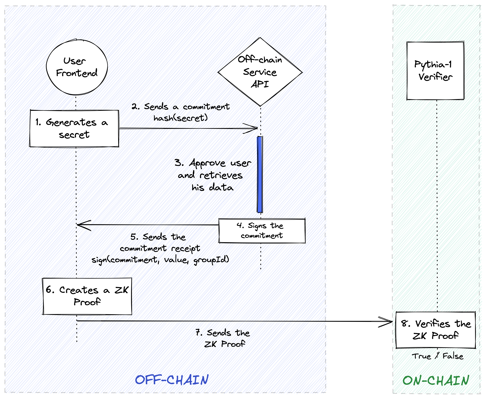

# Pythia ZK Proving Scheme

In ancient Greek religion, Pythia was the oracle of Apollo’s temple at Delphi.

The Pythia Family bundles proving schemes enabling users to prove off-chain data provided by a centralized service while preserving their privacy.&#x20;

The main idea behind Pythia proving schemes is that centralized services [blind sign ](https://en.wikipedia.org/wiki/Blind\_signature)user data.  It ensures that the service cannot trace the user when they later use this signature as proof.


Your national ID can be stored by a KYC provider. You can belong to the group of people over 18 years old according to this data.

Your number of followers on Twitter is stored by Twitter. You can belong to the group of twitter accounts with over 100K followers according to this data.


### Pythia Proving Scheme Family

A Proving Scheme has a **prover** that is able to generate proofs for a **verifier** that can verify their validity.

In the Pythia-1 Proving Scheme, the user will interact with the off-chain service using a **Blind Signature Scheme** to retrieve their data in a privacy preserving way.

The user frontend (**prover**) can then **create a ZK Proof.**

The **verifier** is an on-chain smart contract, called a **Pythia-1 Verifier**. The Pythia-1 Verifier is a smart contract that will verify the ZK proof and return its validity in the form of a True or False statement.

For example, in the implementation of the Pythia-1 attester in the Sismo Protocol, if the proof is correct, the user will mint a [ZK Badge](../../sismo-badges/zk-badge-protocol/badges.md).

You can see the Pythia-1 Proving Scheme in the following schema that will be explained in the next section.

<figure><figcaption>
Pythia-1 Proving Scheme
</figcaption></figure>

### Pythia-1 Proving Scheme

The Pythia-1 Proving Scheme works as follows:

1. A user generates a **commitment** on his frontend (the Poseidon hash of a **secret**). The secret is randomly generated by the frontend.

$$
Commitment = PoseidonHash(secret)
$$

2\. The **commitment** is sent to the off-chain service API (can be a KYC Provider, DegenScore, Twitter, Github…)

3\. The off-chain service retrieves the user data with the user consent, it can be a KYC registration or an account verification for example.

4\. The off-chain service then generates a **Commitment Receipt**. The Commitment Receipt is the signature ([edDSA](https://fr.wikipedia.org/wiki/EdDSA)) of the commitment sent by the user, the value of the user data and the group Id.

$$
CommitmentReceipt = signEdDSA(Commitment, value, groupId)
$$


The value can be the number of followers the user has on Twitter or the age on his national ID card for example. It will be kept secret thanks to the ZK proof. The groupId is the id for the group he claims to be eligible (the group of people with over 100K followers on Twitter or the group of people over 18 years old)


5\. The Commitment Receipt is sent to the user frontend.

6\. In the frontend, the ZK Proof is generated from private and public inputs:

* Private inputs
  * the **secret**
  * the **value**
  * the **Commitment** **Receipt**
* Public inputs
  * the **groupId** for the badge
  * a **nullifier** that can be stored on-chain for a sybil-resistant badge
  * the **public key** of the off-chain service

$$
nullifier = PoseidonHash(secret, externalNullifier)
$$

7\. The proof is then sent on-chain to the verifier contract.

8\. The verifier contract verifies the ZK proof on-chain.


In the Sismo Protocol, the ZK Proof is sent to the Pythia-1 Attester that calls the Pythia-1 Verifier contract. If the Pythia-1 Verifier contract returns a True statement about the ZK Proof, the Pythia-1 Attester issues an attestation and a ZK Badge for the user on the destination address he provided in the proof.



No one is able to link the user web2 account to the destination address that received the badge!

