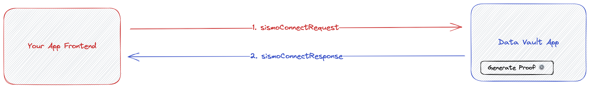

# Data Vault App

The Sismo Data Vault application is the prover from which a [Sismo Connect](../readme/sismo-connect.md) application requests user proofs.&#x20;

This page details the input and output specifications of the Data Vault application and the way it communicates with your application after integrating Sismo Connect.

<figure><figcaption><p>Data Vault App flow</p></figcaption></figure>

The Data Vault application receives a `sismoConnectRequest` as an input and sends a `sismoConnectResponse` as an output.

The communication between your application and the Data Vault application is made only through query parameters.

Users are redirected from your application to the Data Vault application, where they generate a zero-knowledge proof. Then, they are redirected back to your application with the zero-knowledge proof in query parameters.


Learn more about Sismo zero-knowledge proofs and use cases [**here**](../technical-concepts/vault-and-proof-identifiers.md).

Learn more about Sismo Connect [**here**](../readme/sismo-connect.md).


## sismoConnectRequest (input) - Redirection to the Data Vault app

This section details the `sismoConnectRequest` specifications and the redirection url to correctly send the `sismoConnectRequest` to the Data Vault app in order for the user to generate a zero-knowledge proof associated with your Sismo Connect app.

Indeed, the `sismoConnectRequest` is the input taken by the Sismo’s Data Vault app. It defines the properties and requirements that the user must meet in order to generate a zero-knowledge proof. The Data Vault app receives the `sismoConnectRequest` as a set of query parameters sent through the url.

### The redirection url

The url is composed of the following base url <mark style="color:blue;">`https://vault-beta.sismo.io/connect`</mark> with the `sismoConnectRequest` in query parameters.

The complete proof request url with the `sismoConnectRequest` in query parameters follows the following format:\
<mark style="color:blue;">`https://vault-beta.sismo.io/connect?version=<data-vault-app-version>&appId=<your-app-id>&claims=<array-of-claims>&auths=<array-of-auths>&signature=<signature-object>&callbackPath=<custom-callback-path>`</mark>

### `sismoConnectRequest`

```typescript
export type SismoConnectRequest = {
  appId: string;
  namespace?: string;

  auths?: AuthRequest[];
  claims?: ClaimRequest[];
  signature?: SignatureRequest;

  devConfig?: DevConfig;
  callbackPath?: string;
  version: string;
};
```

* [**`appId`**](sismo-connect/#appid) : the unique identifier of your application registered on the Sismo Factory app.
* [**`namespace`**](sismo-connect/#namespace) : By default set to “main”. You can optionally define a `namespace` on top of the `appId` to use the Sismo Connect flow in different parts of your application.
* **`callbackPath`**: by default, the Data Vault app redirects users to the referrer url (your application url) at the end of the proof generation flow. You can specify an optional callback path to the referrer url.
* [**`version`**](sismo-connect/#version): the version of the Data Vault app queried. Current version is “sismo-connect-v1” version is available.
* [**`auths`**](sismo-connect/#auth): Array of objects that hold all the information needed to generate proof of account ownership.

```typescript
export type AuthRequest = {
  uuid?: string; // for internal uses
  authType: AuthType; // default: VAULT
  // (soon™) Does not reveal the userId with which the user performs the auth
  isAnon?: boolean; // false
  // Request a specific user
  userId?: string;
  // Define if the auth is optional or not.
  // If so, the auth is not mandatory to generate the proof and successfully verify it
  isOptional?: boolean;
  // Make the account whose ownership the user wants to prove selectable
  isSelectableByUser?: boolean;
  extraData?: any;
};

export enum AuthType {
  VAULT,
  GITHUB,
  TWITTER,
  EVM_ACCOUNT,
}
```

* [**`claims`**](sismo-connect/#claim): Array of objects containing all the information needed to generate proofs of group membership.

```typescript
export type ClaimRequest = {
  uuid?: string; // for internal uses
  claimType?: ClaimType; // default: GTE
  // the group identifier used to check
  // if the user is eligible in order to generate the zero-knowledge proof.
  groupId?: string;
  // the timestamp of the group snapshot for which the user had to be eligible to
  // in order to generate the zero-knowledge proof.
  groupTimestamp?: number | "latest";
  // A group is a mapping of account and value pairs.
  // Limiting eligibility to users in the group with a specified value.
  value?: number; // default: 1
  // Define if the claim is optional or not.
  // If so, the claim is not mandatory to generate the proof and successfully verify it
  isOptional?: boolean; // default: false
  // Make the value the user wants to use to prove membership selectable
  // e.g. value is 1, the user has a value of 3, he can choose to prove the value 2
  isSelectableByUser?: boolean; // default: true
  extraData?: any; // default: ''
};

export enum ClaimType {
  GTE,
  GT,
  EQ,
  LT,
  LTE,
}
```

* [**`signature`**](sismo-connect/#signedmessage): It contains the message that the user should sign.

```typescript
export type SignatureRequest = {
  message: string; // message to sign
  isSelectableByUser?: boolean; // make the message editable by the user 
  extraData?: any;
};
```

* **`devConfig`** : Allow developers to display the complete response in the Data Vault frontend after having generated the proof and not redirect him to the initial app. It also allows you to configure a list of addresses to make eligible for the group it uses.

```typescript
export type DevConfig = {
  enabled?: boolean;
  displayRawResponse?: boolean; // display or not the response
  devGroups?: DevGroup[]; // the list of addresses for a specific group
};

export type DevGroup = {
  groupId: string;
  groupTimestamp?: number | "latest";
  data: DevAddresses; // the list of addresses
};

export type DevAddresses = string[] | Record<string, Number | BigNumberish>;
```

> **Example of a Data Vault app query**\
> \
> <mark style="color:blue;">`https://vault-beta.sismo.io/connect?version=sismo-connect-v1&appId=0x112a692a2005259c25f6094161007967&claims=[{"groupId":"0xe9ed316946d3d98dfcd829a53ec9822e","claimType":0,"extraData":"","groupTimestamp":"latest","value":1}]`</mark>
>
>
>
> **When we deconstruct this query, it means:**
>
> * User is requested to generate a zero-knowledge proof using the Data Vault app version: `sismo-connect-v1`.
> * User is requested to generate a proof for the Sismo Connect app with an appId of `0x112a692a2005259c25f6094161007967` and for the namespace `main`.
> * User is requested to prove that he belongs to the `latest` group snapshot of the identified group `0xe9ed316946d3d98dfcd829a53ec9822e` (here the `sismo-contributors` group).
> * User is requested to prove that he has a minimum ("claimeType":0 corresponds to "GTE") value registered in the group snapshot of `1`.
>
>
>
> **HTML integration example:**
>
> ```html
> //Example of proof request integration without using the Sismo Connect Client package
> <html>
>   <body>
>     <a
>       href='<https://vault-beta.sismo.io/connect?version=sismo-connect-v1&appId=0x112a692a2005259c25f6094161007967&claims=[{"groupId":"0xe9ed316946d3d98dfcd829a53ec9822e","claimType":0,"extraData":"","groupTimestamp":"latest","value":1}]'
>       >Sismo Connect</a
>     >
>   </body>
> </html>
> ```

## sismoConnectResponse (output)  - Output of the Data Vault app

Once the user has imported an eligible account into the Data Vault app that meets the criteria of your `sismoConnectRequest`, the app generates a `sismoConnectResponse` and sends it back to your application.

This section details the `sismoConnectResponse` specifications and the redirection url to correctly send it back to the requesting application.

Indeed, the `sismoConnectResponse` is the output send by the Data Vault app to the requesting application once the user has finished the zero-knowledge proof generation flow. The app receives the `sismoConnectResponse` as a JSON sent through the url.

### Redirection url to your application

At the end of the proving scheme, the Data Vault app redirects to the referrer url (your application url), appending the `sismoConnectResponse` in a JSON stringified format as a query parameter: <mark style="color:blue;">`https://www.app.io?sismoConnectResponse=${JSON.stringify(sismoConnectResponse)}`</mark>

### `sismoConnectResponse`

```typescript
export type SismoConnectResponse = {
  appId: string;
  namespace?: string;
  version: string;
  signedMessage?: string;
  proofs: SismoConnectProof[];
};
```

* [**`appId`**](sismo-connect/#appid) : the unique identifier of your application registered on the Sismo Factory app.
* [**`namespace`**](sismo-connect/#namespace) : By default set to “main”. You can optionally define a `namespace` on top of the `appId` to use the Sismo Connect flow in different parts of your application.
* [**`version`**](sismo-connect/#version): the version of the Data Vault app queried. Current version is “sismo-connect-v1” version is available.
* [**`signedMessage`**](sismo-connect/#signedmessage): It contains the message of the user signed.
* **`proofs`**: It contains all the proofs asked by the `sismoConnectRequest`

```typescript
export type SismoConnectProof = {
  auths?: Auth[];
  claims?: Claim[];
  provingScheme: string;
  proofData: string;
  extraData: any;
};
```

[**`auths`**](sismo-connect/#auth)**:** The data requested to generate a proofs of account ownership.

```typescript
export type Auth = {
  uuid?: string;
  authType: AuthType;
  isAnon?: boolean; //false
  isSelectableByUser?: boolean;
  userId?: string;
  extraData?: any;
};
```

[**`claims`**](sismo-connect/#claim)**:** The data requested to generate a group membership proofs.

```typescript
export type Claim = {
  uuid?: string;
  claimType?: ClaimType;
  groupId?: string;
  groupTimestamp?: number | "latest";
  isSelectableByUser?: boolean;
  value?: number;
  extraData?: any;
};
```

**`provingScheme`**: the proving scheme name used during the proof generation flow. Currently (and by default), only the "hydra-s2.1" proving scheme is available.

**`proofData`**: the cryptographic proof returned by the proving scheme

### How to read the `sismoConnectResponse` on your application

```tsx
// in your application
<html>
  <script>
      const urlParams = new URLSearchParams(window.location.search);
      const reponse = urlParams.get("sismoConnectResponse");
      console.log(JSON.parse(reponse));
  </script>
</html>
```

### Verifying the `sismoConnectResponse` validity

The `sismoConnectResponse` validity can be verified by:

* Your application backend
* Your smart contract

To do checkout the [sismoConnect packages docs ](sismo-connect/)and follow the [sismoConnect packages tutorials](../tutorials/sismo-connect/).
