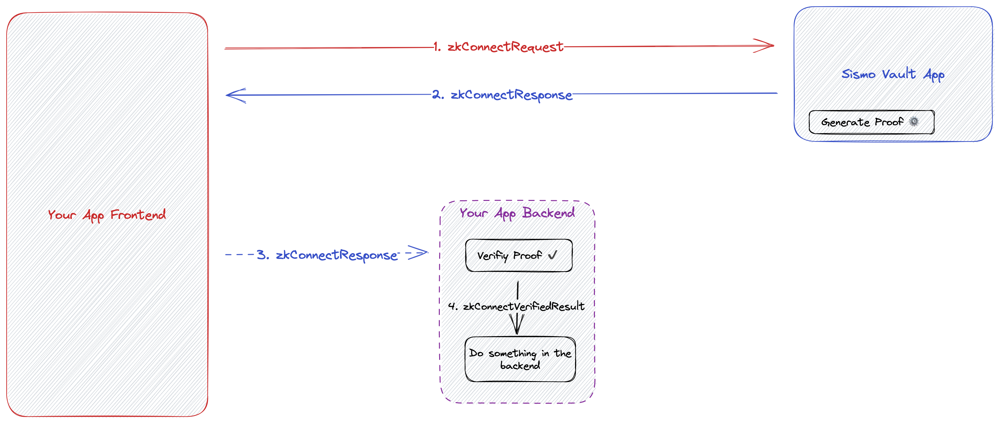

# sismoConnect Server: Verify Off-chain

The [sismoConnect](../../what-is-sismo/sismoconnect.md) Server is a backend package built on top of the [Hydra-S2 Verifier](https://github.com/sismo-core/hydra-s2-zkps) to easily verify proofs from your users off-chain. You can see a full guide on how to integrate sismoConnect into your application [here](../../tutorials/sismoconnect/sismo-connect-guide.md).

<figure><figcaption><p>sismoConnect offchain full flow</p></figcaption></figure>

## Installation

Install [sismoConnect](../../what-is-sismo/sismoconnect.md) server package in your backend with `npm` or `yarn`:

```bash
# with npm
npm i @sismo-core/sismo-connect-server
# with yarn
yarn add @sismo-core/sismo-connect-server
```


Make sure to have at least v18.15.0 as Node version. You can encounter issues with ethers dependencies if not.


## Usage

#### Configuration

The first step for integrating sismoConnect in your backend is to create a `sismoConnectConfig`. This config will require an `appId` and can be customized with optional fields. You can go to the [Sismo Factory](https://factory.sismo.io/apps-explorer) to register an appId.

```typescript
import { SismoConnect, SismoConnectServerConfig } from "@sismo-core/sismo-connect-server";

const sismoConnectConfig: SismoConnectServerConfig = {
  // you will need to register an appId in the Factory
  appId: "0x8f347ca31790557391cec39b06f02dc2",
}

// create a new SismoConnect instance with the server configuration
const sismoConnect = SismoConnect(sismoConnectConfig);
```

#### Create a ClaimRequest and or AuthRequest

The claimRequest and the authRequest will be used to verify that the proof is valid, these requests must match with the requests in your frontend.

```typescript
const CLAIM_REQUEST = { groupId: "0x42c768bb8ae79e4c5c05d3b51a4ec74a"};
const AUTH_REQUEST = { authType: AuthType.ANON };
```

#### Verify proofs from your users

Proofs need to be sent to your backend with a SismoConnectResponse. The verify function takes as inputs a SismoConnectResponse, a ClaimRequest, an AuthRequest and verifies that the proof is cryptographically valid with respect to these requests.

```typescript
// verifies the proofs contained in the sismoConnectResponse 
// with respect to the group in the dataRequest
const { verifiedAuths, verifiedClaims } = await sismoConnect.verify(
  sismoConnectResponse,
  { 
    claimRequest: CLAIM_REQUEST,
    authRequest: AUTH_REQUEST
  }
);

const anonUserId = verifiedAuths[0].userId;
const proofId = verifiedClaims[0].proofId;
```

## Documentation

#### **`SismoConnectServerConfig`**

The `SismoConnectServerConfig` allows you to fully customize your sismoConnect integration in your backend. Its only mandatory field is the `appId`. For more liberty when prototyping, it also comes with an optional devMode field that allows developers to only verify that proofs are cryptographically valid without respect to a certain group.

```typescript
export type SismoConnectServerConfig = {
  // the appId registered in the Factory
  appId: string,
  devMode?: {
    // will use the Dev Sismo Data Vault https://dev.vault-beta.sismo.io/
    enabled?: boolean, 
  },
  options?: {
    // optional ethers provider you can use to check the Merkle Tree root for groups
    // default: public gnosis provider
    provider?: Provider;
    // additional options for the verifier
    verifier?: VerifierOpts;
  }
};

export type VerifierOpts = {
  // additonal options for the hydras2 verifier
  hydraS2?: HydraS2VerifierOpts;
  isDevMode?: boolean;
};

export type HydraS2VerifierOpts = {
  // the provider referenced in the SismoConnectServerConfig
  provider?: Provider;
  // the commitment mapper registry contract address used by the verifier
  // default: https://gnosisscan.io/address/0xe205Fb31B656791850AC65f0623937Bf6170a5Da
  commitmentMapperRegistryAddress?: string;
  // the available roots registry contract address used by the verifier
  // default: https://gnosisscan.io/address/0x453bF14103CC941A96721de9A32d5E3d3095e049
  availableRootsRegistryAddress?: string;
  isDevMode?: boolean;
};
```

#### `SismoConnectResponse`

The SismoConnectResponse needs to be sent by the frontend so that the backend can verify the proofs contained in it.

```typescript
type SismoConnectResponse = {
    // the appId registered in the Factory
    appId: string;
    // sismoConnect version
    version: string;
    // service from which the proof is requested
    namespace?: string;
    proofs: SismoConnectProof[]
}

type SismoConnectProof = {
    auth?: Auth;
    claim?: Claim;
    signedMessage?: string | any;
    provingScheme: string;
    proofData: string;
    extraData: any;
}
```

#### `verify`

```typescript
type SismoConnectVerifiedResult = SismoConnectResponse & {
  signedMessages: string[]
  verifiedClaims: VerifiedClaim[]
  verifiedAuths: VerifiedAuth[]
}

type VerifiedClaim = Claim & {
  proofId: string
  __proof: string
}

export type Claim = {
  groupId?: string
  groupTimestamp?: number | 'latest' // default to "latest"
  value?: number // default to 1
  claimType?: ClaimType // default to GTE
  extraData?: any // default to ''
}

type VerifiedAuth = Auth & {
  __proof: string
}

export type Auth = {
  authType: AuthType
  // Contain the id of the auth you ask
  // May contain an anon userId, a github id or a twitterId
  userId?: string 
}

async function verify(sismoConnectResponse: SismoConnectResponse,{ claimRequest, authRequest, namespace }: VerifyParamsSismoConnect): Promise<SismoConnectVerifiedResult>;
```

If the proof contained in the `sismoConnectResponse` is valid, the function should return a `SismoConnectVerifiedResult`, otherwise, it should throw an error.

In a `SismoConnectVerifiedResult`, you can get a userId, which is a unique identifier that identifies an account from your user Sismo Vault.&#x20;

```typescript
// get a vaultId out of valid proofs
const { verifiedAuths } = await sismoConnect.verify(
  sismoConnectResponse,
  { 
    authRequest: AUTH_REQUEST,
    claimRequest: CLAIM_REQUEST
  }
);

const userId = verifiedAuths[0].userId;

// get proofId out of valid proofs
const { verifiedClaims } = await sismoConnect.verify(
  sismoConnectResponse,
  { dataRequest: DATA_REQUEST }
);

const proofId = verifiedClaims[0].proofId;

```

#### `anonUserId` and Proof Ids

In the userId you can find depending on the authType you ask a Github Id for AuthType.Github, a Twitter id for AuthType.Twitter or an anonUserId for AuthType.ANON.

It is worth noting that the `anonUserId` is deterministically generated based on the user vault secret and the `appId` with a Poseidon hash. This means that if a user has already used your app, the `vaultId` will be the same each time this user use your app but it will be different for other apps. This is useful if you want to store the `vaultId` in your database to link it to a user while preserving the privacy of this same user between apps. You can learn more about the `vaultId` [here](../../technical-concepts/vault-and-proof-identifiers.md).

You can also find a `proofId` in the `verifiedClaims` of the `SismoConnectVerifiedResult`. This `proofId` is a unique identifier that identifies a proof from Sismo. This `proofId` is also deterministically generated based on the `appId`, the `namespace`, the `groupId` and the `groupTimestamp`. This `proofId` will allow you to know if a user already proved something to your app for a specific namespace and group.&#x20;

This `proofId` can be useful if you want to allow your users to participate in private polls while ensuring only one vote each time. For each poll, you can specify a different namespace such as `namespace: "my-poll-x"` so that a different proofId is computed each time. By storing the `proofId` alongside the `vaultId` in your apps, you can now ensure that a user with a specific `vaultId` only votes one time for each private polls.

Here are some small snippets to get&#x20;

#### Frontend

<pre class="language-typescript"><code class="lang-typescript">// private-poll-1.tsx
import { SismoConnect, SismoConnectClientConfig, DataRequest, AuthType } from "@sismo-core/sismo-connect-client";

const sismoConnect = SismoConnect({
  // sismoConnectClientConfig will only appId
  appId: "0x8f347ca31790557391cec39b06f02dc2", 
});

const CLAIM_REQUEST = { 
    groupId: "0x42c768bb8ae79e4c5c05d3b51a4ec74a",
};
const AUTH_REQUEST = { 
    authType: AuthType.ANON,
};
<strong>sismoConnect.request({ 
</strong>  claimRequest: CLAIM_REQUEST,
  authRequest: AUTH_REQUEST,
  namespace: "my-private-poll-1", // 👈 --> namespace for private poll 1
});

const sismoConnectResponseOne = sismoConnect.getResponse();

// you then send this sismoConnectResponse to your backend
</code></pre>

```typescript
// you do the same with another poll 
// private-poll-2.tsx
import { SismoConnect, SismoConnectClientConfig, DataRequest, AuthType } from "@sismo-core/sismo-connect-client";

const sismoConnect = SismoConnect({
  appId: "0x8f347ca31790557391cec39b06f02dc2", 
});

const CLAIM_REQUEST = { 
    groupId: "0x42c768bb8ae79e4c5c05d3b51a4ec74a",
};
sismoConnect.request({ 
  claimRequest: CLAIM_REQUEST, 
  authRequest: AUTH_REQUEST,
  namespace: "my-private-poll-2", // 👈 --> namespace for private poll 2
});

const sismoConnectResponseTwo = sismoConnect.getResponse();

// you then send this sismoConnectResponse to your backend
```

#### Backend

<pre class="language-typescript"><code class="lang-typescript">import { DataRequest, SismoConnect, SismoConnectServerConfig } from "@sismo-core/sismo-connect-server";
<strong>
</strong><strong>const sismoConnect = SismoConnect({
</strong>  appId: "0x8f347ca31790557391cec39b06f02dc2", 
});

const CLAIM_REQUEST = { 
    groupId: "0x42c768bb8ae79e4c5c05d3b51a4ec74a",
};

const AUTH_REQUEST = { 
    authType: AuthType.ANON,
};

const { verifiedClaimsOne, verifiedAuthsOne } = await sismoConnect.verify(
    sismoConnectResponseOne, // 👈 --> sismoConnectResponse for private poll 1
    {
      claimRequest: CLAIM_REQUEST,
      authRequest: AUTH_REQUEST,
    }
);


const { verifiedClaimsTwo, verifiedAuthsTwo } = await sismoConnect.verify(
    sismoConnectResponseTwo, // 👈 --> sismoConnectResponse for private poll 2
    {
      claimRequest: CLAIM_REQUEST,
      authRequest: AUTH_REQUEST,
    }
);


const proofIdOne = verifiedClaimsOne[0].proofId;
const anonUserIdOne = verifiedAuthsOne[0].userId

const proofIdTwo = verifiedClaimsTwo[0].proofId;
const anonUserIdTwo = verifiedAuthsTwo[0].userId

// anonUserIdOne === anonUserIdTwo
// but
// proofIdOne !== proofIdTwo
// You can know if an anonUserId has already voted on a private poll 
// by storing the proofIds 🤘
</code></pre>
