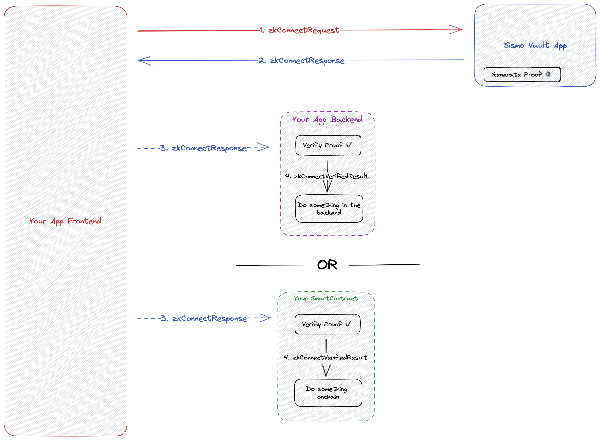

# zkConnect

[zkConnect](../../what-is-sismo/zkconnect.md) is a privacy-preserving single sign-on method for applications. Once integrated, applications can request private, granular data from users, while users can authenticate and selectively reveal their data thanks to zero-knowledge proofs (ZKPs).

Here is the 2 different flows of zkConnect:

<figure><figcaption>
zkConnect full flow
</figcaption></figure>

**zkConnect features:**

* **4 packages:**
  * ``[`@sismo-core/zk-connect-client`](https://github.com/sismo-core/zk-connect-packages/tree/main/packages/zk-connect-client): the frontend package to easily request ZKPs from users of Sismo in a privacy-preserving manner.
  * ``[`@sismo-core/zk-connect-react`](https://github.com/sismo-core/zk-connect-packages/tree/main/packages/zk-connect-react): the React frontend package to easily integrate the zkConnectButton and zk-connect-client in your React app.
  * [`@sismo-core/zk-connect-server`](https://github.com/sismo-core/zk-connect-packages/blob/main/packages/zk-connect-server): the backend package to easily verify these ZKPs offchain.
  * [@sismo-core/zk-connect-solidity](https://github.com/sismo-core/zk-connect-onchain-verifier) : the Solidity Library to easily verify these ZKPs onchain.

In order to use [zkConnect](../../what-is-sismo/zkconnect.md), you will need to have an `appId` registered in the [Sismo Factory](https://factory.sismo.io/apps-explorer). You can register your appId [here](https://factory.sismo.io/apps-explorer).

You can see this guide for a full example on how to integrate zkConnect in your application: [zkConnect Guide](../../tutorials/zkconnect/zk-connect-guide.md).

## Glossary&#x20;

### appId

The unique identifier of your application registered on the Sismo Factory app.

### namespace&#x20;

By default set to “main”. You can optionally define a `namespace` on top of the `appId` to use the zkConnect flow in different parts of your application. This is useful if you do not want users to generate the same proof for different services in your application. For example, if your application is a DAO voting website, you may define a different `namespace` for every vote and use the `proofId` as a nullifier. Henceforth, users will be able to vote only once as each proof request with a distinct `namespace` generates a distinct `proofId` for the same user. Learn more about the proof identifier [**here**](../../technical-concepts/vault-and-proof-identifiers.md).

### version

The version of the Data Vault app. The only version that work is now `zk-connect-v2`.

### groupId

The unique identifier of the group of accounts to which the user must prove that he belongs to in order to generate the proof. Groups are maintained by the Sismo protocol and can be created by anyone using the [Sismo Factory](https://factory.sismo.io/). Groups are composed of a name, a description, specifications, a timestamp, and data. Moreover, Groups are split into Group Snapshots which are a timestamped.

Learn more about groups [**here**](../sismo-api/group/).

### groupTimeStamp

Groups are composed of snapshots generated either once, daily, or weekly. Each Group Snapshot generated has a timestamp associated to them. By default, the selected group is the latest Group Snapshot generated. But you are free to select a Group Snapshot with a different timestamp than the latest generated one.

Claim, Auth and SignedMessage are objects used to prove facts about your data:

### Claim

A Claim is requested through a claimRequest to the Data Vault in order to generate a group membership proof. It contains the group Id, the groupTimestamp, the value you claim to have in this group.&#x20;

A claim is a group membership request for a specific value.

Example: Prove that you are part of the Sismo Contributor Group with a minimum value of 2.

Learn more about accounts and value [**here**](../zk-badge-protocol/groups.md)**.**

### Auth

An Auth is requested through an authRequest to the Data Vault in order to generate a proof of account ownership. It can be an ownership of a Ethereum address or a Twitter, GitHub account.

Example: Prove that you own a Twitter account.

### SignedMessage

A Signed Message request will request to generate a proof that can't be verified without this specific message associated to it.

Example: You are a DAO voting website, and you want to get the vote of a user. The user will create a signedMessage containing this vote. Then this vote will be used to generate the proof validity.
