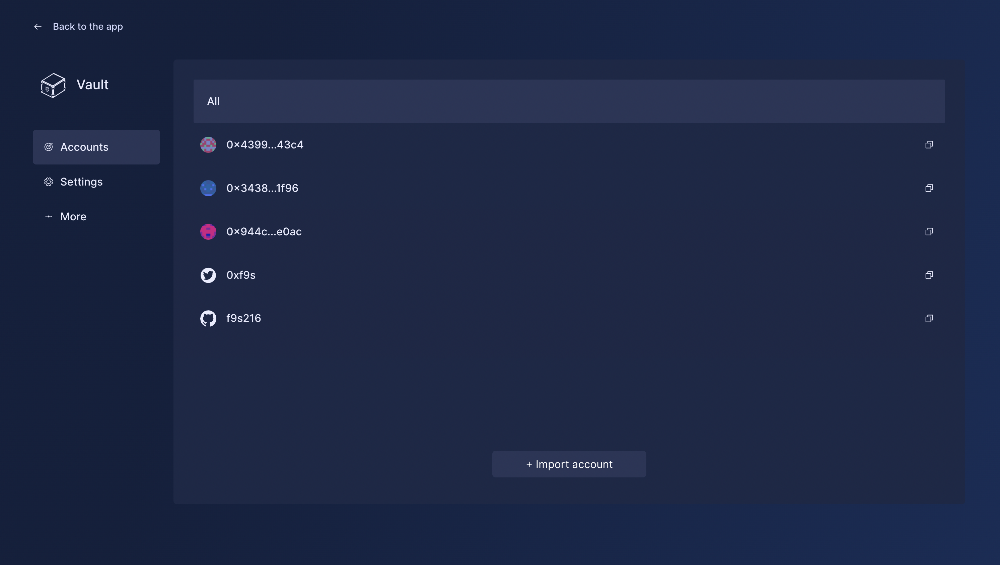

# Personal Data: Sismo’s Data Vault, Gems & Groups

Fundamentally, Sismo revolves around communication between personal data and applications. To utilize Sismo’s communication protocol, users must aggregate their identity in the Data Vault—encrypted storage for a user's personal data from various web2 and web3 accounts, credentials, and attestations. These contents are collectively referred to as Data Sources.

Data Gems, derived from Data Sources stored in the Data Vault, represent valuable elements of a user's digital identity and categorize their owners into certain Data Groups. Proving ownership of Data Gems, and thus membership in Data Groups, enables users to leverage their data without revealing the associated Data Source. In addition, users can authenticate themselves by revealing a Data Source directly instead of the granular data inside.


You can create your own Data Vault and start aggregating your identity [here](https://vault-beta.sismo.io/).


## Data Vault in Action

Envision the Data Vault as an encrypted aggregator that securely stores various Data Sources, such as Ethereum addresses, GitHub and Twitter accounts, and other attestations from relevant authorities. Once users have imported a Data Source, Sismo enables them to prove ownership and selectively disclose information to applications without compromising privacy.

<figure><figcaption></figcaption></figure>

For instance, imagine a user has imported two Ethereum addresses: a public ENS domain and a private wallet owning a specific NFT. Sismo allows them to:

1. Prove ownership of their public wallet (Data Source)
2. Selectively disclose they own the NFT (Data Gem) without revealing their private wallet.

The Data Vault ensures users have full control over their aggregated digital identity, with the flexibility to authenticate and share information on their own terms. As the starting point for end users to leverage Sismo’s communication protocol, the Data Vault reshapes how users interact with applications and manage their digital presence.

When accessing an application via [Sismo Connect](../#sismo-connect-the-crypto-native-sso), users can choose which Data Sources and Data Gems they want to selectively disclose.

<figure><figcaption></figcaption></figure>

## Data Gems & Data Groups

The atomic pieces of data stored in a user’s Data Vault, housed within Data Sources, are characterized as Data Gems. A Data Gem is a valuable element of a user’s digital identity that can be proven via Sismo Connect. Examples of Data Gems include:

* Entrants to the Proof of Humanity registry
* Sismo Contributors
* French citizens

As Data Gems can be leveraged independently of their Data Source, they can be seen as fungible and account-agnostic within the confines of the Data Vault. Data Gems can be revealed without exposing the source of truth or associated owner via verifiable claims. Picture Data Gems as precious material (i.e. personal data) that can be dislodged from its source and stashed away in the Data Vault.

Technically speaking, a Data Gem is a piece of data with all of the following:

* An owner - i.e, an associated Ethereum address or web2 account
* A value - i.e, a number corresponding to a certain level of reputation
* A type - i.e, a unique groupId combined with a timestamp (latest by default) that sorts users into a specific Data Group

Fundamentally, Data Gems prove a user’s membership in a specific Data Group. Due to the data accrued on their accounts (web2 or web3), all users inherently belong to Data Groups. For example, holders of NFTs in the same collection own a similar Data Gem and are thus in the same Data Group. The number of NFTs held by a particular user is represented by the Data Gem’s value. Users in the same Data Group can bring the same element of their identity to applications via Sismo Connect.

## Create Data Groups

Anyone building applications with Sismo Connect must utilize Data Groups to request data from users. Creating a Data Group merely highlights preexisting data—rendering it visible to the Sismo communication protocol. These Data Groups are used as sources of truth from which users can make verifiable claims (e.g. being part of the Proof of Humanity Data Group).

There are currently two ways to create Data Groups:

* Through Sismo’s [Factory no-code interface](../sismo-factory/what-is-the-sismo-factory.md)
* Through a pull request in the [Sismo Hub](../knowledge-base/resources/sismo-hub/sismo-hub/create-your-group.md) - the Factory’s open-source back end

Alternatively, builders can utilize Data Groups created for existing Sismo Connect applications.
